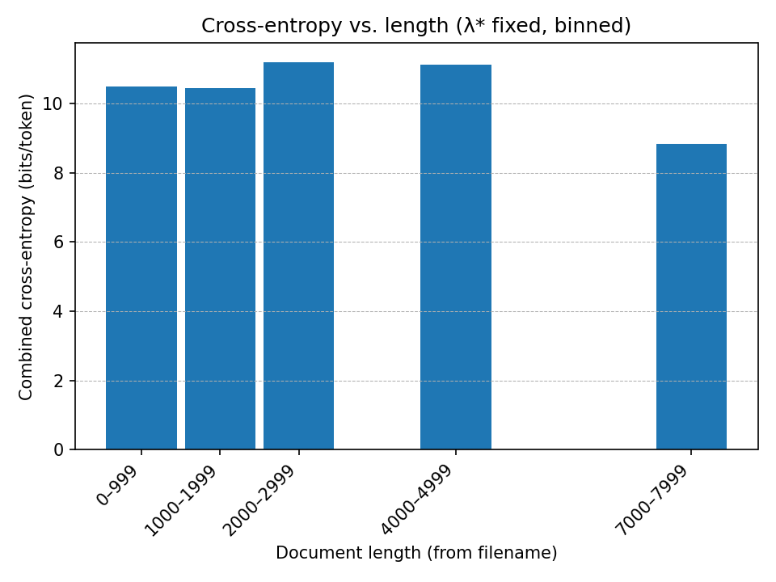
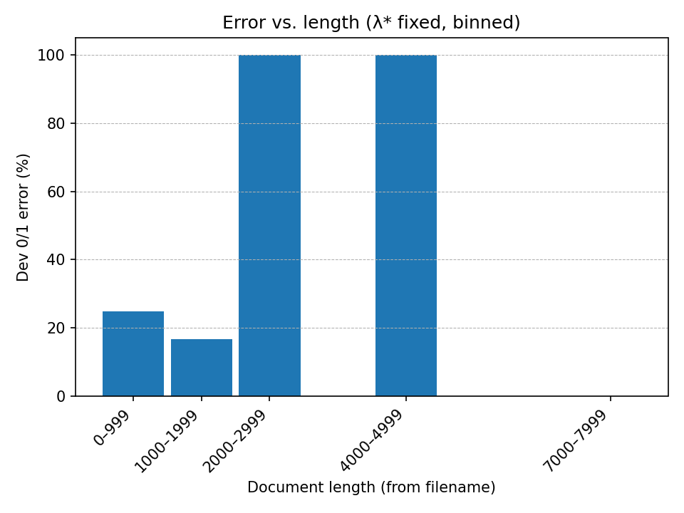
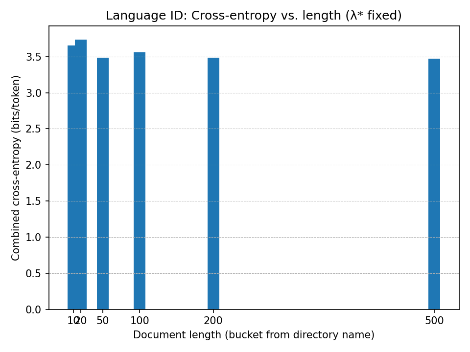
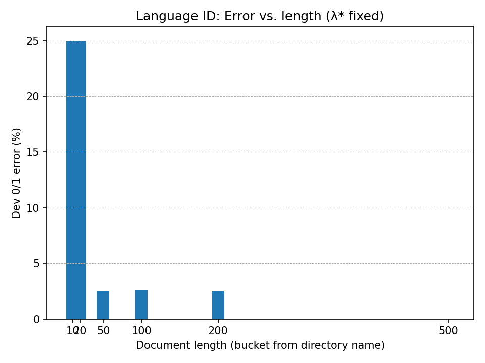
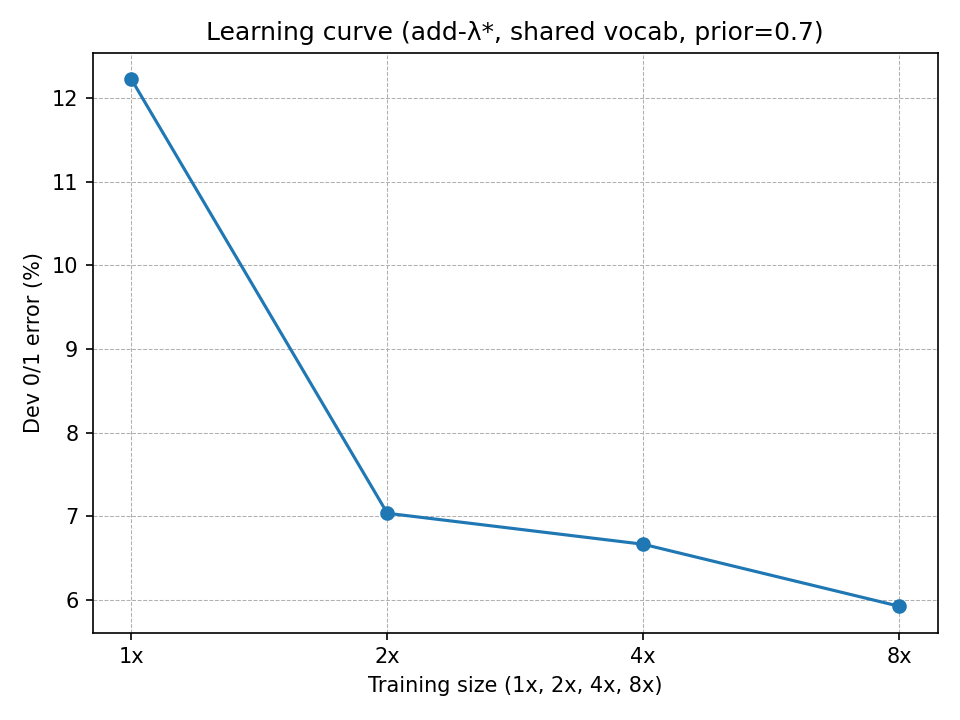
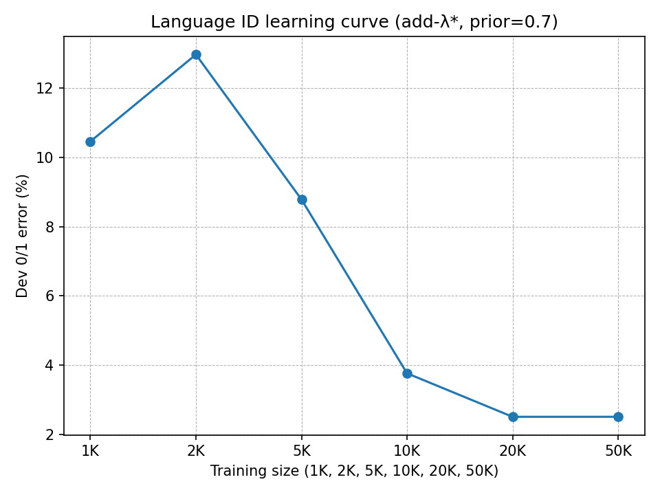

## Q1：

tabel 1
|            | switchboard-small |               | switchboard |               |
|------------|------------------:|---------------|------------:|---------------|
|            | log-prob          | cross-entropy | log-prob    | cross-entropy |
| **Sample1** | -8282.07          | 7.85052       | -6819.01    | 6.46370       |
| **Sample2** | -5008.97          | 8.30622       | -4192.79    | 6.95278       |
| **Sample3** | -5085.45          | 8.29012       | -4195.70    | 6.83969       |

---

tabel 2
| perplexity | switchboard-small | switchboard |
|------------|------------------:|------------:|
| **Sample1** | 230.8             | 88.3        |
| **Sample2** | 316.5             | 123.9       |
| **Sample3** | 313.0             | 114.5       |

When trained on the larger switchboard corpus, the log₂-probabilities
become less negative and the perplexities are much lower. This is
because the larger dataset provides more n-gram evidence, reducing
sparsity and allowing the model to assign higher probabilities to test
sequences. As a result, the model's predictions are closer to the true
distribution, leading to lower cross-entropy and perplexity.

## Q3:
(a) The result is: 
247 files were more probably from gen.model (91.48%)
23 files were more probably from spam.model (8.52%)
Expected error rate on dev files: 0.2522 (270 files)
Average log-loss on dev files: 6.5242 bits per doc (270 files)
Actual 0/1 error rate on dev files: 0.2556 (270 files)

(b) The result is: 
115 files were more probably from en1k.model (48.12%)
124 files were more probably from sp1k.model (51.88%)
Expected error rate on dev files: 0.1017 (239 files)
Average log-loss on dev files: 1.1601 bits per doc (239 files)
Actual 0/1 error rate on dev files: 0.0962 (239 files)

(c) Minimum prior P(gen) to classify ALL dev as spam = 0.0000.
The result Minimum prior P(gen) = 0.0000 means there exists at least one dev document whose likelihood under the gen model is vastly higher than under spam (i.e., a very large delta = logp(d|gen)-logp(d|spam)). To force even that document to be labeled spam, you’d have to set P(gen) to an essentially zero prior, which rounds to 0.0000 at display precision. In practical terms, under any reasonable prior, the classifier will not label all dev files as spam.

(d)&(e) Results:
best lambda on dev/gen   -> 0.005  (9.046160 bits/token)
best lambda on dev/spam  -> 0.005 (9.095720 bits/token)
best lambda on combined  -> 0.005 (9.068397 bits/token)
Sweeping lambda in {5, 0.5, 0.05, 0.005, 0.0005}, the dev cross-entropy is minimized at lambda=0.005 (combined 9.068 bits/token). Larger lambda over-smooths toward uniform, while very small lambda under-smooths and overfits, so a mid-range lambda performs best.

(f)

With λ* fixed, combined cross-entropy is fairly flat around 10–11 bits/token from 0–5k, then drops to ~8.9 bits/token for 7–8k, suggesting longer documents are easier because they provide more evidence. The 0/1 error decreases from ~25% (0–999) to ~16% (1k–1.9k), but the 100% spikes in the 2–3k and 4–5k bins are artifacts of extremely tiny bin counts (likely 1 doc), so they aren’t statistically meaningful. Overall, performance improves with length when bins contain enough examples; sparse-length regions should be merged or ignored.

(g)

Cross-entropy is 3.6–3.7 bits/token for 10–100 chars and then declines steadily (≈3.5 at 200, ≈3.45 at 500), meaning the classifier is more confident with longer inputs.
0/1 error is high for 10-char strings (≈25%) but drops to 2–3% for 50–200 and 0% at 500, showing that length sharply reduces ambiguity.

(h)

Error drops sharply when moving from 1× to 2× training data (12.3% to 7.0%), then improves more slowly at 4× (6.6%) and 8× (5.9%), showing clear diminishing returns. More data reduces n-gram sparsity, but the model’s capacity and class overlap limit further gains. As training size to infinite, the curve will approach a positive floor rather than 0.

(i)

Error decreases markedly as training grows: from 13% at 2K to 8.8% at 5K and 3.8% at 10K, then flattens near 2.5% at 20–50K, showing strong diminishing returns.
The small bump at 2K over 1K likely reflects variance at tiny data scales or a suboptimal lambda* for that size.
Overall, more data helps, but the curve approaches a non-zero floor due to model bias and class overlap.

## Q4:
(a) For uniform estimate, every word, including 'oov', has a possibility of $\frac{1}{19999}$. However, this could be summed to $\frac{20000}{19999}$ and leaves out 'oov' with 0 probability. Model will then not be able to accept any new word.

Based on the add-$\lambda$ formula, we could have a trigram:
$$\hat{p}(z|xy)=\frac{c(xyz)+\lambda}{c(xy)+\lambda V}$$
Therefore, when $V = 19999$, if $\lambda =0$, the smooth is removed; if $\lambda>0$, the denominater would increase, and it falls into the same that the summation of all the probabilities is larger than 1. The 'oov' has 0 possibility.  

(b) If $\lambda =0$, then it is a maximum-likelihood estimate that model overfits the training corpus, assuming there is no new word. The bias is 0, yet the variance is high since unseen words could be severe noises which make the result unstable.  

(c) No, it doesn't. With smoothing, if $p(xyz)=0$, $\hat{p}(z|xy)$ could be backoffed to $\hat{p}(z|x)$, which might not be 0, and so is $\hat{p}(z'|xy)$. Therefore, they are not neccesarily equal.
Given the smooth formula, we have:
$$\hat{p}(z|xy)=\frac{c(xyz)+\lambda V\hat{p}(z|y)}{c(xy)+\lambda V}=\frac{\lambda V\hat{p}(z|y)}{c(xy)+\lambda V}$$

If $c(xyz)=c(xyz')=1$, we have:
$$\hat{p}(z|xy)=\frac{1+\lambda V\hat{p}(z|y)}{c(xy)+\lambda V}.$$
Since it is unknown whether $\hat{p}(z|y)=\hat{p}(z'|y)$, the answer is still not necessarily equal.

(d) When $\lambda$ increases, the ratio of the backed-off version model, (n-1)-gram, will become more weighted. Since model with less context (n gets smaller) could have larger possibilities for words, which introduces more smoothing, resulting in less variance and higher bias. Model tends to underfit the current corpus but to have a more stable result.  
