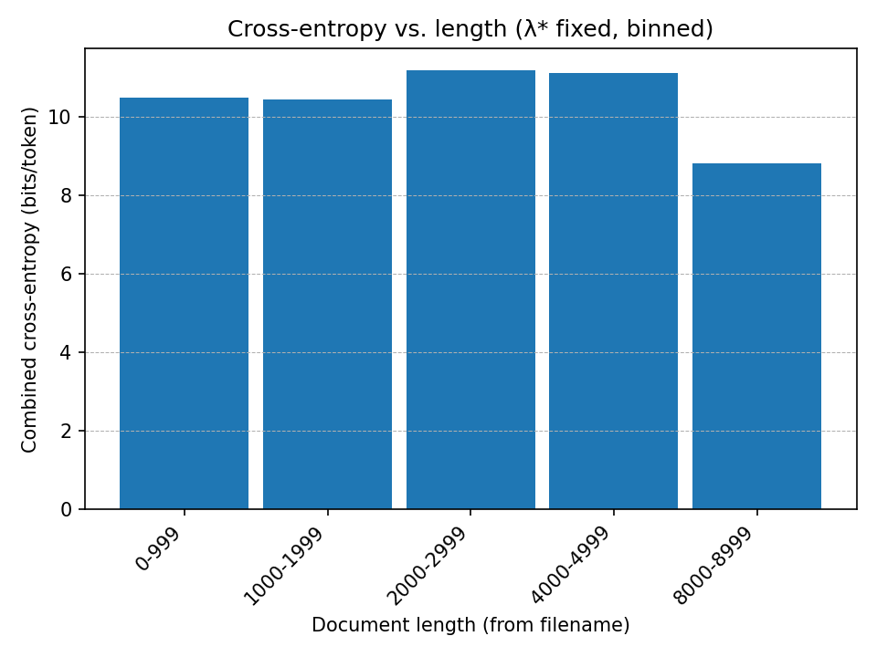
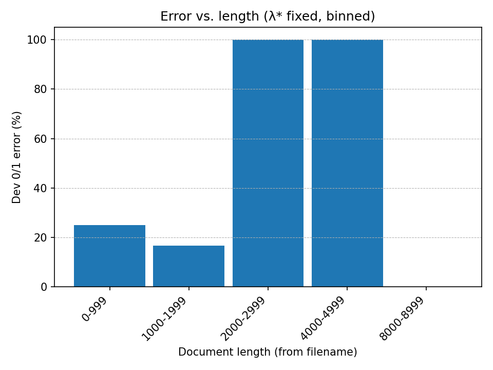

## Q1：

tabel 1
|            | switchboard-small |               | switchboard |               |
|------------|------------------:|---------------|------------:|---------------|
|            | log-prob          | cross-entropy | log-prob    | cross-entropy |
| **Sample1** | -8282.07          | 7.85052       | -6819.01    | 6.46370       |
| **Sample2** | -5008.97          | 8.30622       | -4192.79    | 6.95278       |
| **Sample3** | -5085.45          | 8.29012       | -4195.70    | 6.83969       |

---

tabel 2
| perplexity | switchboard-small | switchboard |
|------------|------------------:|------------:|
| **Sample1** | 230.8             | 88.3        |
| **Sample2** | 316.5             | 123.9       |
| **Sample3** | 313.0             | 114.5       |

When trained on the larger switchboard corpus, the log₂-probabilities
become less negative and the perplexities are much lower. This is
because the larger dataset provides more n-gram evidence, reducing
sparsity and allowing the model to assign higher probabilities to test
sequences. As a result, the model's predictions are closer to the true
distribution, leading to lower cross-entropy and perplexity.

## Q3:
(a) The result is: 
247 files were more probably from gen.model (91.48%)
23 files were more probably from spam.model (8.52%)
Expected error rate on dev files: 0.2522 (270 files)
Average log-loss on dev files: 6.5242 bits per doc (270 files)
Actual 0/1 error rate on dev files: 0.2556 (270 files)

(b) The result is: 
115 files were more probably from en1k.model (48.12%)
124 files were more probably from sp1k.model (51.88%)
Expected error rate on dev files: 0.1017 (239 files)
Average log-loss on dev files: 1.1601 bits per doc (239 files)
Actual 0/1 error rate on dev files: 0.0962 (239 files)

(c) Minimum prior P(gen) to classify ALL dev as spam = 0.0000.
The result Minimum prior P(gen) = 0.0000 means there exists at least one dev document whose likelihood under the gen model is vastly higher than under spam (i.e., a very large delta = logp(d|gen)-logp(d|spam)). To force even that document to be labeled spam, we have to set P(gen) to an essentially zero prior, which rounds to 0.0000 at display precision.
To be more specific, if all documents are classified as spam, we have:
$$\log p(d_i|gen)+\log p(gen)\leq\log p(d_i|spam)+\log p(spam)\\
\log \frac{1-p(gen)}{p(gen)}\geq \triangle_i = \log p(d_i|gen)- \log p(d_i|spam)\\p(gen)\leq \frac{1}{1+e^{\triangle_i}}$$.
Therefore, the largest $p(gen) = min(\frac{1}{1+e^{\triangle_i}}) \rightarrow0$.   
In practical terms, under any reasonable prior, the classifier will not label all dev files as spam.

(d)&(e) Results:
lambda	split	bits_per_token	logprob_sum	tokens_sum
5	    gen	    11.05263	    -534704.134	48378
5	    spam	11.07215	    -435954.834	39374
0.5	    gen	    10.15485	    -491271.333	48378
0.5	    spam	10.26566	    -404200.097	39374
0.05	gen	    9.29458	        -449653.191	48378
0.05	spam	9.44152	        -371750.408	39374
0.005	gen	    9.04616	        -437635.128	48378
0.005	spam	9.09572	        -358134.879	39374
0.0005	gen	    9.49982	        -459582.292	48378
0.0005	spam	9.41952	        -370884.18	39374

best $\lambda$ on dev/gen   -> 0.005  (9.046160 bits/token)
best $\lambda$ on dev/spam  -> 0.005 (9.095720 bits/token)
best $\lambda$ on combined  -> 0.005 (9.068397 bits/token)
Sweeping $\lambda$ in {5, 0.5, 0.05, 0.005, 0.0005}, the dev cross-entropy is minimized at $\lambda=0.005$ (combined 9.068 bits/token). Larger $\lambda$ over-smooths toward uniform, while very small $\lambda$ under-smooths and overfits, so a mid-range $\lambda$ performs best.

(f)

With λ* fixed, combined cross-entropy is fairly flat around 10–11 bits/token from 0–5k, then drops to ~8.9 bits/token for 7–8k, suggesting longer documents are easier because they provide more evidence. The 0/1 error decreases from ~25% (0–999) to ~16% (1k–1.9k), but the 100% spikes in the 2–3k and 4–5k bins are artifacts of extremely tiny bin counts (likely 1 doc), so they aren’t statistically meaningful. Overall, performance improves with length when bins contain enough examples; sparse-length regions should be merged or ignored.

(g)

Cross-entropy is 3.6–3.7 bits/token for 10–100 chars and then declines steadily (≈3.5 at 200, ≈3.45 at 500), meaning the classifier is more confident with longer inputs.
0/1 error is high for 10-char strings (≈25%) but drops to 2–3% for 50–200 and 0% at 500, showing that length sharply reduces ambiguity.

(h)

Error drops sharply when moving from 1× to 2× training data (12.3% to 7.0%), then improves more slowly at 4× (6.6%) and 8× (5.9%), showing clear diminishing returns. More data reduces n-gram sparsity, but the model’s capacity and class overlap limit further gains. As training size to infinite, the curve will approach a positive floor rather than 0.

(i)

Error decreases markedly as training grows: from 13% at 2K to 8.8% at 5K and 3.8% at 10K, then flattens near 2.5% at 20–50K, showing strong diminishing returns.
The small bump at 2K over 1K likely reflects variance at tiny data scales or a suboptimal lambda* for that size.
Overall, more data helps, but the curve approaches a non-zero floor due to model bias and class overlap.

## Q4:
(a) For uniform estimate, every word, including 'oov', has a possibility of $\frac{1}{19999}$. However, this could be summed to $\frac{20000}{19999}$ and leaves out 'oov' with 0 probability. Model will then not be able to accept any new word.

Based on the add-$\lambda$ formula, we could have a trigram:
$$\hat{p}(z|xy)=\frac{c(xyz)+\lambda}{c(xy)+\lambda V}$$
Therefore, when $V = 19999$, if $\lambda =0$, the smooth is removed; if $\lambda>0$, the denominater would increase, and it falls into the same that the summation of all the probabilities is larger than 1. The 'oov' has 0 possibility.  

(b) If $\lambda =0$, then it is a maximum-likelihood estimate that model overfits the training corpus, assuming there is no new word. The bias is 0, yet the variance is high since unseen words could be severe noises which make the result unstable.  

(c) No, it doesn't. With smoothing, if $p(xyz)=0$, $\hat{p}(z|xy)$ could be backoffed to $\hat{p}(z|x)$, which might not be 0, and so is $\hat{p}(z'|xy)$. Therefore, they are not neccesarily equal.
Given the smooth formula, we have:
$$\hat{p}(z|xy)=\frac{c(xyz)+\lambda V\hat{p}(z|y)}{c(xy)+\lambda V}=\frac{\lambda V\hat{p}(z|y)}{c(xy)+\lambda V}$$

If $c(xyz)=c(xyz')=1$, we have:
$$\hat{p}(z|xy)=\frac{1+\lambda V\hat{p}(z|y)}{c(xy)+\lambda V}.$$
Since it is unknown whether $\hat{p}(z|y)=\hat{p}(z'|y)$, the answer is still not necessarily equal.

(d) When $\lambda$ increases, the ratio of the backed-off version model, (n-1)-gram, will become more weighted. Since model with less context (n gets smaller) could have larger possibilities for words, which introduces more smoothing, resulting in less variance and higher bias. Model tends to underfit the current corpus but to have a more stable result.  

## Q6:
INFO: model=swsmall_backoff_add0.1.model  num=10  max_length=20
01: right
02: and it's not it's just like you know incineration place they just something i spent every one check a problem
03: but who his what
04: and then
05: oh yeah
06: and but i like eating any difference there like in plano
07: right
08: what they're really good experience and you know how you
09: i mean fifty thousand people who are are burning up a very quickly
10: oh yeah

INFO: model=swsmall_add0.1.model  num=10  max_length=20
01: well it's ann form readily tend handy dress experienced particles choosing p discovered took face we've pennsylvania floor seeds uncle ...
02: yeah
03: and they're church every appealing classes choices runs department package he's sesame g decision none automatically due our grandmothers fly ...
04: uh i terrible household wise case discovered ways expense served speech hole stand frying tailored do losing rest but down ...
05: uh_huh cornstarch lobby sad move tablespoons county skid relationships manager cup elaborate laws gone buy se floor united thrown popular ...
06: but here milk high plastic austin sweaters expected unless science homemade away suspect these standards luck chips coat become familiar ...
07: uh late record expenses be wish silly trouble iowa taught contributing kitchenette compared supposed sweat bed island unleaded ponds economy ...
08: so i facing comfortable otherwise should various party retirement tech firm flying diane falls pounds eventually drove beans vegetarian grow ...
09: do opened neighbors advertising ground overnight sales adding purchases half kitchenette nuts appreciate bag august opinion crust lower contribute mall ...
10: and i'm example thoroughly burning useful talks arthritis heart getting frozen year luck true celery hates enough consideration yeah human ...

With backoff, samples collapse to frequent conversational frames (“right”, “oh yeah”, “and then”) and end early—more conservative and fluent because unseen contexts fall back to lower-order estimates. Pure add-λ produces longer, content-heavy but rambling strings with odd word choices—more diverse, but noticeably less coherent, and close to uniform sampling.

## Q7:
(c)
1.
(1) After traverse every C with the smae d, the best C* could be either 0 or 0.1 since they result in the same cross entropy (11.11602). However, it's better to have C for the when d is enlarged. Therefore, the best C is C* = 0.1.
(For computing the error-rate, we maintain p(gen)=0.7.)
| (C,d) | cross-entropy(bits/token) | expected error rate | average log-loss(bits/doc) | actual error rate| 
|------------|------------------:|------------:|-------------:|------:|
| C=0,d=10 |      11.11602       |   0.1950     | 4.2611 | 0,2000|
| C=0.1,d=10 |    11.11602       |   0.1950     | 4.2611 | 0.2000|
| C=0.5,d=10 |      11.11603       |   0.1950      | 4.2611  | 0.2000|
| C=1,d=10 |    11.11603          | 0.1950    | 4.2611 | 0.2000|
| C=5,d=10 |     11.11608        |    0.1950    | 4.2610  | 0.1963 |
| C=0.1,d=50 |    9.9538        |    0.1544    | 4.6077  | 0.1556 |
| C=5,d=200 |       8.4790      |    0.0881    | 2.8393  | 0.0889 |

(2) When d=10. varying C almost does not impact the result of corss-entropy, neither error rate. This is because the embedding dimension is too small (not much feature types) for model to overfit the data. Normally, model easily underfit the data, and adding regularization in this circumstance does not make different, since it is meant to punish overfit situation.
(3) For add-lambda model, we have cross-entropy of 10.452 and error rate of 0.2522. While for log-linear model, when d is small (d=10), the cross-entropy is higher than add-lambda model's due to that the log-linear model underfits the data. The features amount is too small. However, when d becomes larger, we can see from the table that the cross entropy of log-linear model decreases significantly, much lower than add-lambda model, which indicate that the amount of features is enough for model to capture important information and represent the data.   

2. Adjusting p(gen) with larger value means shifting the decision boundary to classify more samples to genuine

3.

(d)

## Q8:
Given an utterance $u$ and $K$ candidate transcripts $\{\tilde{w}_1,\dots,\tilde{w}_K\}$,
we choose the best candidate by Bayes' rule:

$$\hat{w}
=\arg\max_{\tilde{w}} P(\tilde{w}\mid u)
=\arg\max_{\tilde{w}} P(u\mid \tilde{w}) P(\tilde{w}).$$

Working in base-2 log domain yields an equivalent criterion:

$$\hat{w}
=\arg\max_{\tilde{w}}
\Big[\log_2 P(u\mid \tilde{w}) + log_2 P(\tilde{w})\Big].$$

The file's 2nd column provides the acoustic-model score $\log_2 P(u\mid \tilde{w})$; we use it directly.
The language-model score is computed by our trigram LM:

$$log_2 P(\tilde{w})
  = \sum_{t} \log_2 P(w_t \mid w_{t-2}, w_{t-1})$$

where the sentence is framed with $<s>$ $<s>$ and $</s>$.
For each candidate $\tilde{w}$, compute:

$$\mathrm{score}(\tilde{w})
= log_2 P(u\mid \tilde{w}) + log_2 P(\tilde{w})$$

and select the candidate with the largest score.

## Q9:
Use swsmall_add0.1.model
0.083   easy021
0.250   easy031
0.500   easy041
0.143   easy051
0.071   easy060
0.170   OVERALL

0.400   speech021
0.667   speech031
0.000   speech041
0.000   speech051
0.500   speech060
0.476   OVERALL

Use swsmall_backoff_add0.1.model
0.167   easy021
0.250   easy031
0.833   easy041
0.143   easy051
0.143   easy060
0.255   OVERALL

0.400   speech021
0.667   speech031
0.000   speech041
0.000   speech051
0.500   speech060
0.476   OVERALL

Obviously, model with only add lambda(0.1) is better. The micro-avg over dev splits favors add-λ, and backoff doesn’t help with this small training set (likely over-discounting rare trigrams on short utterances).
A fair selection uses only development data to choose smoothing (no peeking at test). It’s also unfair to use the reference line (first row) or the WER column when choosing a candidate—only AM log-prob (col 2) + LM score should be used.

## Q10:
1) Model (Word LM + Char LM mixture)

Train a word-level trigram LM that explicitly allocates probability mass to an `OOV` bucket under each context $(x,y)$. Denote

$$P_{\text{word}}(z\mid x,y), \qquad
\beta(x,y)\equiv P(\text{OOV}\mid x,y)$$,

where $P_{\text{word}}(,\cdot\mid x,y)$ is normalized only over the seen vocabulary
$V_{\text{seen}}$ (types observed in training), and $\beta(x,y)$ is the mass reserved for unseen words.

Independently, train a character n-gram LM (with BOS/EOS at the character level). For any word spelling $z=c_1\ldots c_m$,

$$P_{\text{char}}(z) = \prod_{t=1}^{m+1} P\big(c_t ,\big|, c_{t-n+1}^{t-1}\big),
\quad c_{m+1}=\text{EOS}.$$

To avoid allocating `OOV` mass to seen words, renormalize the character distribution over the unseen domain:

$$\tilde P_{\text{char}}(z)=
\begin{cases}
\dfrac{P_{\text{char}}(z)}{\displaystyle\sum_{w\notin V_{\text{seen}}} P_{\text{char}}(w)}, & z\notin V_{\text{seen}},[12pt]
0, & z\in V_{\text{seen}}.
\end{cases}$$

The final open-vocabulary conditional distribution is the mixture
$$P(z\mid x,y)=
\begin{cases}
\big(1-\beta(x,y)\big),P_{\text{word}}(z\mid x,y), & z\in V_{\text{seen}},[6pt]
\beta(x,y),\tilde P_{\text{char}}(z), & z\notin V_{\text{seen}}.
\end{cases}$$
Normalization holds:

$$\sum_{z} P(z\mid x,y)
= (1-\beta)\sum_{z\in V_{\text{seen}}}P_{\text{word}}(z\mid x,y)
* \beta!!\sum_{z\notin V_{\text{seen}}}\tilde P_{\text{char}}(z)
  = (1-\beta)\cdot1+\beta\cdot1=1.$$

2) Training

Word trigram LM. Count and smooth as usual (e.g., add-($\lambda$), backoff). Treat `OOV` as a dedicated type during training so that you obtain both $P_{\text{word}}(\cdot\mid x,y)$ over $V_{\text{seen}}$ and the `OOV` mass $\beta(x,y)=P(\text{OOV}\mid x,y)$.
Character n-gram LM. Train on all word spellings (characters with BOS/EOS), with smoothing. This model is naturally normalized over the space of strings.

3) Scoring/Sampling

Given context $(x,y)$ and candidate word $z$:

If $z\in V_{\text{seen}}$, use $(1-\beta(x,y)),P_{\text{word}}(z\mid x,y)$.
If $z\notin V_{\text{seen}}$, use $\beta(x,y),\tilde P_{\text{char}}(z)$.

If $x$ or $y$ is itself unseen, apply the usual backoff within the word LM $trigram \to bigram \to unigram$ to compute $P_{\text{word}}$ and $\beta$. The character component $\tilde P_{\text{char}}$ is context-independent and can be used as is.

 4) Intuition

The word LM handles known words precisely;
The reserved `OOV` mass $\beta(x,y)$ is distributed across specific unseen spellings by the character LM, yielding a true open vocabulary;
Renormalizing over the unseen set preserves total probability 1 and prevents “stealing” mass from seen words.

